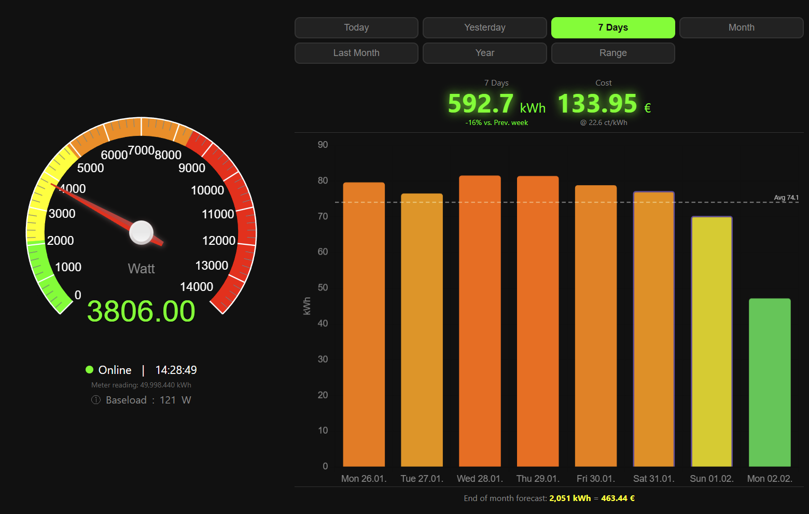
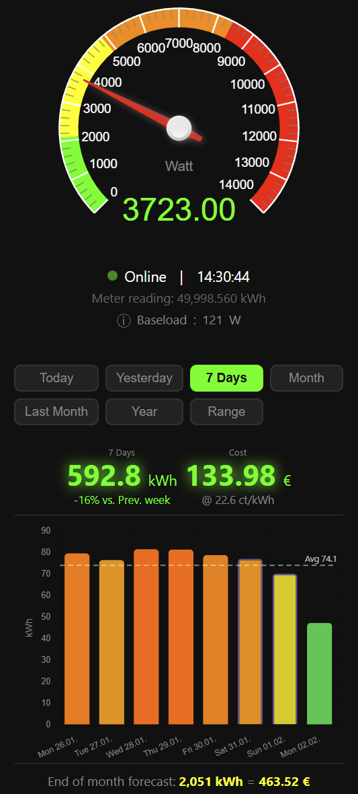

# ⚡ simple-energy-dash

**Smart meter monitoring without the smart home overhead.**

A lightweight, self-hosted energy dashboard. One Flask app, one SQLite database, zero complexity. No Grafana, no Home Assistant, no InfluxDB – just plug in your IR reading head and go. Runs on any Linux system, ideal for Raspberry Pi.

<table>
  <tr>
    <td align="center"><b>Desktop View</b> – Real-time gauge, historical charts, cost tracking</td>
  </tr>
  <tr>
    <td></td>
  </tr>
  <tr><td></td></tr>
  <tr>
    <td align="center"><b>Mobile View</b> – Responsive dark UI</td>
  </tr>
  <tr>
    <td align="center"></td>
  </tr>
</table>

## Why this?

Most energy monitoring solutions require a complex stack (Home Assistant + Grafana + InfluxDB + Prometheus) or expensive proprietary hardware. This project is a single Python app that does one thing well: show your energy usage in a clean, responsive dashboard.

## Features

- **Real-time power gauge** – Auto-scaling based on 7-day peak, color-coded zones
- **Historical charts** – Hours, days, months view with custom date range picker
- **Cost tracking** – Configurable electricity price, monthly forecast
- **Baseload detection** – Identifies minimum standby power (2:00–5:00 AM)
- **Smart aggregation** – Raw → Minute → Hour → Day data compression via cron job
- **Responsive design** – Dark theme, works on desktop, tablet, and mobile
- **Period comparison** – Automatic percentage change vs. previous period
- **Multi-language** – English and German included, easily extensible
- **Offline-capable** – Local SQLite database, no cloud dependency

## Architecture

```
IR Reading Head → Smart Meter (SML/OBIS)
        ↓
   Tasmota / ESP
        ↓ MQTT
   Mosquitto Broker
        ↓ paho-mqtt
   Flask Backend → SQLite DB
        ↓ REST API
   Browser Dashboard (Vanilla JS + Chart.js + Canvas Gauges)
```

## Requirements

- Any Linux system (Raspberry Pi 3B+ or newer recommended)
- Python 3.9+
- Smart meter with SML/OBIS protocol
- MQTT-capable smart meter reader, for example:
  - [SHRDZM Smartmeter Module](https://www.shrdzm.com) – Plug & play module for Austrian/German smart meters (M-Bus, P1, IR). Decryption onboard, MQTT output, no additional hardware needed.
  - Tasmota-flashed ESP8266/ESP32 with IR reading head (e.g. Hichi TTL, Bitshake)
  - Any device that publishes OBIS data as JSON via MQTT
- Mosquitto MQTT broker

## Quick Start

```bash
git clone https://github.com/hl9020/simple-energy-dash.git
cd simple-energy-dash
python3 -m venv venv && source venv/bin/activate
pip install -r requirements.txt
cp .env.example .env    # edit to match your setup
python app.py
```

Open `http://<your-pi-ip>:5000` in your browser.

## Configuration

Edit `.env` to match your setup:

| Variable | Default | Description |
|---|---|---|
| `APP_LANG` | `en` | UI language (`en`, `de`) |
| `PRICE_KWH` | `0.226` | Electricity price per kWh (all-in) |
| `CURRENCY_SYMBOL` | `€` | Currency symbol (€, $, £, CHF...) |
| `MQTT_HOST` | `127.0.0.1` | MQTT broker address |
| `MQTT_PORT` | `1883` | MQTT broker port |
| `MQTT_TOPIC` | `sensor` | MQTT topic your smartmeter publishes to |
| `OBIS_POWER` | `1.7.0` | OBIS code for current power (Watt) |
| `OBIS_ENERGY` | `1.8.0` | OBIS code for total energy (Wh) |
| `OBIS_ENERGY_DIVISOR` | `1000` | Divisor for energy value (1000 = Wh→kWh) |
| `FLASK_HOST` | `0.0.0.0` | Flask bind address |
| `FLASK_PORT` | `5000` | Flask port |
| `DB_PATH` | `instance/energy.db` | SQLite database path |
| `BASELOAD_HOUR_START` | `2` | Baseload detection start hour |
| `BASELOAD_HOUR_END` | `5` | Baseload detection end hour |

## Installation

### System Dependencies

```bash
sudo apt update && sudo apt upgrade -y
sudo apt install -y python3 python3-pip python3-venv mosquitto mosquitto-clients
```

### Aggregation Cron Job

Compresses raw data over time to keep the database small:

```bash
crontab -e
```

Add (runs every hour):
```
0 * * * * cd /home/$USER/simple-energy-dash && ./venv/bin/python aggregate.py >> /var/log/energy-aggregate.log 2>&1
```

### Autostart with systemd

```bash
sudo nano /etc/systemd/system/simple-energy-dash.service
```

```ini
[Unit]
Description=Simple Energy Dash
After=network.target mosquitto.service

[Service]
Type=simple
User=pi
WorkingDirectory=/home/pi/simple-energy-dash
ExecStart=/home/pi/simple-energy-dash/venv/bin/python app.py
Restart=always
RestartSec=5

[Install]
WantedBy=multi-user.target
```

```bash
sudo systemctl daemon-reload
sudo systemctl enable simple-energy-dash
sudo systemctl start simple-energy-dash
```

## Smart Meter Setup

This dashboard receives data via MQTT from a smart meter reader. Common setups:

1. **SHRDZM Smartmeter Module** – Austrian-made module with onboard decryption. Supports M-Bus, P1, and IR interfaces. Outputs via MQTT, no additional ESP or Tasmota needed. See [shrdzm.com](https://www.shrdzm.com/).
2. **Tasmota + ESP8266/ESP32** – Flash an ESP with Tasmota, configure SML scripting. See [Tasmota Smart Meter Interface](https://tasmota.github.io/docs/Smart-Meter-Interface/).
3. **Hichi IR Reader** – USB/WiFi IR reading heads for Austrian/German smart meters.

Any device that publishes OBIS codes as JSON via MQTT will work:
```json
{
  "1.7.0": 350.5,
  "1.8.0": 12345678
}
```

## Project Structure

```
simple-energy-dash/
├── app.py              # Flask backend, MQTT subscriber, REST API
├── aggregate.py        # Cron job for data aggregation
├── requirements.txt    # Python dependencies
├── lang/
│   ├── en.json         # English translations (default)
│   └── de.json         # German translations
├── .env.example        # Configuration template
├── static/
│   ├── css/style.css   # Dark theme responsive styling
│   └── js/app.js       # Dashboard frontend
├── templates/
│   └── index.html      # Single page HTML template
└── docs/
    ├── dashboard.png   # Desktop screenshot
    └── mobile.png      # Mobile screenshot
```

## Language

Set `APP_LANG=de` in `.env` for German. Add your own language by creating a new JSON file in `lang/`.

## Tech Stack

- **Backend:** Python 3, Flask, Flask-SQLAlchemy, paho-mqtt
- **Database:** SQLite (zero-config, file-based)
- **Frontend:** Vanilla JavaScript, Chart.js, Canvas Gauges
- **Messaging:** MQTT via Mosquitto
- **Styling:** Custom CSS, dark theme, responsive grid

## License

[MIT](LICENSE)
